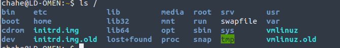
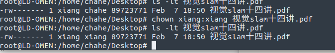

# 熟悉Linux

## 安装软件

sudo apt install xxxx

软件会被安装在/usr/share/中，对应文件夹中包括动态链接库等文件

可执行文件位于/usr/bin/ 中

2.环境变量定义：变量是计算机系统用于保存可变值的数据类型，我们可以直接通过变量名称来提取到对应的变量值。**在 Linux 系统中，环境变量是用来定义系统运行环境的一些参数，比如每个用户不同的家目录（HOME）、邮件存放位置（MAIL）等。**

## 环境变量设置

格式

```
#equal
export VAR_NAME = value
#想修改此前设置的值，比如在后面添加
export PATH=$PATH:/path/to/your/file
```


全局环境变量

- 直接写入/etc/profile （不推荐）
- 在/etc/profile.d/创建bash脚本，写入语句

用户环境变量

​			在~/.bashrc中写入环境变量，仅对当前用户有效，并且为了在当前终端生效，需要source bashrc文件

补充：bashrc和bash_profile的区别

`.bash_profile` and `.bashrc` are files containing shell commands that are run when Bash is invoked. `.bash_profile` is read and executed on interactive login shells, while `.bashrc` on non-login shells.

## 根目录



bin用于存放二进制文件

boot用于存放启动 Linux 时使用的一些核心文件，包括一些连接文件以及镜像文件

dev用于存放外部设备

home用于存放各个用户的目录

lib存放各种动态链接共享库

root是系统管理员目录

usr用于存放用户的应用程序

## 增加权限

chmod +x a.sh

## 修改所有者

```
# add group 
sudo groupadd xiang
# add user
sudo useradd -g xiang xiang
```



# SLAM综述文件阅读

1. slam常用于室外自动驾驶定位建图，室内机器人以及无人机导航，AR，VR等应用。

2. 定位和建图的关系： 定位和建图是相辅相成的，定位后得到的传感器信息（来自图像，激光雷达）能够用于建图，同时，建图后得到的路标信息等也能帮助更好的定位。定位的同时去建图，是因为，根据地图，我们才能执行路径规划，场景感知等其他任务，并且，建图后得到的路标信息可以支持相对位姿的估计，回环检测等操作，进一步提高定位精度。

3. Slam发展的几个阶段

   1. 经典时代（classical age）1986--2004:在这期间，基于概率的方式被引入用于状态估计，比较经典的算法包括粒子滤波，扩展卡尔曼。
   2. 算法分析时代（algorithmic analysis age）2004--2015：slam的基本属性，比如能观性，收敛性，连续性被进一步关注，此外，slam解算器的稀疏性的重要性被更深刻的理解。

4. SLAM领域经典文献

   1. Zhang, Ji, and Sanjiv Singh. "LOAM: Lidar Odometry and Mapping in Real-time." *Robotics: Science and Systems*. Vol. 2. No. 9. 2014.

      在这篇论文中，基于激光雷达的点线特征的slam方法被提出，并且因为其实时性，准确性，成为后来基于特征点的lidar slam的重要参考文献。

   2. Qin, Tong, Peiliang Li, and Shaojie Shen. "Vins-mono: A robust and versatile monocular visual-inertial state estimator." *IEEE Transactions on Robotics* 34.4 (2018): 1004-1020.

      在这篇论文中，单目相机和imu的融合提供了效果很好的定位，基于imu和单目相机的紧耦合方案得到了更多的关注

   3. Mur-Artal, Raul, Jose Maria Martinez Montiel, and Juan D. Tardos. "ORB-SLAM: a versatile and accurate monocular SLAM system." *IEEE transactions on robotics* 31.5 (2015): 1147-1163.

      ORB SLAM是目前基于特征点的视觉slam的重要参考项目